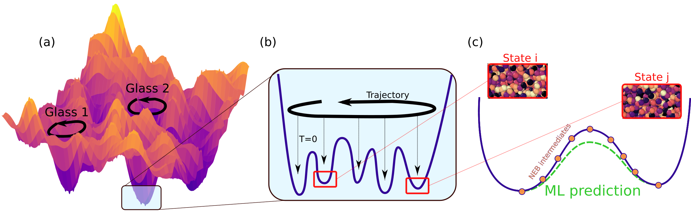
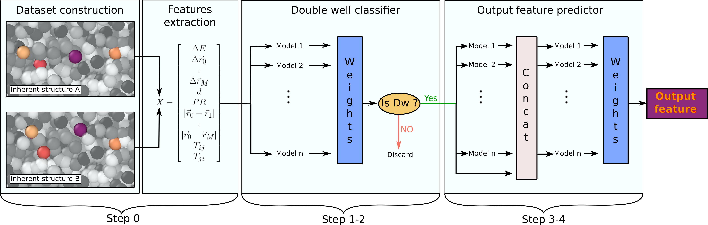

# Finding two-level systems in glasses through machine learning

*by Simone Ciarella, Dmytro Khomenko, Ludovic Berthier, Felix C. Mocanu, David R. Reichman, Camille Scalliet and Francesco Zamponi*
  
Paper link: [**arXiv: 2212.05582**](https://arxiv.org/abs/2212.05582)

Two-level systems (TLS) are rare quantum tunneling defects which govern the physics of glasses at very low temperature. Because of their extremely low density, it is very hard to directly identify them in computer simulations of model glasses. We introduce a machine learning approach to efficiently explore the potential energy landscape of glass models and identify two-level tunneling defects. We design an algorithm that is able to rapidly predict the quantum splitting between any two amorphous configurations produced by classical simulations. This in turn allows us to shift the computational effort towards the collection and identification of a larger number of TLS, rather than the useless characterization of non-tunneling defects which are much more abundant. Finally, we interpret our machine learning model to understand how TLS are identified and characterized, thus giving physical insight into the features responsible for their presence.

---
*In this repository we share the code used to produce the main findings of the paper. This approach can be easily generalized to study other state-to-state transitions*

---
  

## State-to-state transitions with machine learning

[**Installation**](#Installation)
| [**Quick run**](#Quick-run)
| [**Reproduce TLS results**](https://arxiv.org/abs/2212.05582)


The idea of this project is to use machine learning to **speed up** the exploration of the landscape of glassy materials or slow dynamics, with particular focus on the *iterative training* scheme that we introduced.
State-to-state transitions like two-level systems are extremely interesting, but when the dynamics is slow they are very hard to find, and the situation is even worse for glassy systems, characterized by an exponential number of states.
The problem is that often the trajectory of the system does not explore directly the targetted state-to-state transitions during the limited observation time.
The ML model that we propose constructs all the pairs of states (even the one that the trajectory never crossed) and rapidly ( s) predicts target crucial properties for the specific transition, thus estimating if the pair is one of the desired transition and if precise calculation is needed. Overall this significantly reduces the computational load. 


## Installation

To install all the prerequired packages from a fresh conda environment run the following
```
conda create -n tls_exploration -y python=3.9
conda activate tls_exploration
conda install -y -c conda-forge statsmodels
conda install -c conda-forge multiprocess -y
git clone https://github.com/SCiarella/autogluon
cd autogluon && ./full_install.sh
```

> **_NOTE_**:  If you are a MacOS user you need to manually install the correct version of LibOMP via:
```
# brew install wget
wget https://raw.githubusercontent.com/Homebrew/homebrew-core/fb8323f2b170bd4ae97e1bac9bf3e2983af3fdb0/Formula/libomp.rb
brew uninstall libomp
brew install libomp.rb
rm libomp.rb
```


Then you can proceed with the download of this package
```
cd ~
git clone https://github.com/SCiarella/TLS_ML_exploration.git
```

The package is already ready to run and it just needs your new data. 

---
## Overview



The repository consist in a series of python codes named `step[0-4].py` . 

In brief, each of them has the following task:
* **step0**.py:  data collection and preprocessing
* **step1**.py:  [re-]train the double well (DW) classifier
* **step2**.py:  DW classification
* **step3**.py:  [re-]train the predictor
* **step4**.py:  prediction of the target property of all the pairs (i.e. the quantum splitting)


Those codes run using the content of the MLmodel directory.
Let's discuss step by step this procedure, using as example the TLS identification problem

#### Step 0: data collection and preprocessing

The first step of the procedure consist in collecting the relevant input features for the different pairs of states.
In the example `step0.py` we load the database of IS pairs that we use in our [paper](https://arxiv.org/abs/2212.05582), which is uploaded on [Zenodo](https://zenodo.org/) [TBD]. 
For the TLS identification, we use the same data structure

| $\Delta E$| $\Delta \vec{r}_{0}$|  $\Delta \vec{r}_{1}$|   $\Delta \vec{r}_{2}$|  d  |  PR |  $|\vec{r}_0-\vec{r}_i|$| ...| 
|-----------|---------------------|----------------------|-----------------------|-----|-----|-----------------------|----|
|           |                     |                      |                       |     |     |                       | ...|
|           |                     |                      |                       |     |     |                       | ...|
|           |                     |                      |                       |     |     |                       | ...|
|           |                     |                      |                       |     |     |                       | ...|


The other directories present in the project are the following:

#### Configurations/*
This contains the IS obtained from the simulations. In order for the codes to work, its content has to respect the following structure:
```
Configurations/minima/T{T_i}/Cnf-{xxx}/{energy_i}.conf.txt
```
or alternatively if you want to use binary file, they should follow this conventions 
```
Configurations/minima/T{T_i}/Cnf-{xxx}/{energy_i}.conf
```
where the `.txt` has been dropped.


#### NEB_calculations/*
This directory contains the *exact* results of the NEB calculations. We need to collect them for two reasons: 
* to validate the AI predictions 
* to re-train the models
The content of the directory has to respect the following convention:
```
NEB_calculations/T{T_i}/NON-DW.txt   		#(list of non DW)
NEB_calculations/T{T_i}/Qs_calcuations.txt 	#(list of calculated Qs)
```

#### output_ML/*
This is the directory that contains the output of the ML. 
*We use to ML predictions to decide for which pairs we run NEB*. In particular this information is contained in 
```
output_ML/T{T_i}/predictedQs_T{T_i}_allpairs.csv 	
```
which lists the predicted qs for all the pairs we have available, and
```
output_ML/T{T_i}/predictedQs_T{T_i}_newpairs.csv 	
```
which lists the predicted qs only for the pairs for which we have not run the NEB.


# Quick run

### First execution
Right after the installation, and *collecting the data* and storing them as explained [here](#Overview) , you can run:
```
python A_*
```
to prepare all the pairs, followed by
```
python B_* && python C_* 
```
to train the dw classifier for the first time.
| :memo:        | Notice that some data are already provided to train the dw classifier and the qs predictor       |
|---------------|:------------------------|

Then in order to predict if your unknown pairs are dw or not you run once again
```
python B_* 
```

Then in order to train the qs predictor you run
```
python F_* 
```
and then you can run
```
python E_* 
```
in order to predict the quantum splitting


### Each time you add new data
Each time you add new data in Configurations/minima, you have to run

```
python A_* && python B_* && python E_* 
```
in order to obtain predictions also for this new data.


| :point_up:        | If you have new NEB results you can **re-train the ML models**. |
|---------------|:------------------------|

In particular you can retrain the dw classifier with
```
python A_* && python C_* 
```
and you can train the qs predictor with
```
python A_* && python E_* 
```

### Validation
It is possible to evaluate the performances of the ML models by running
```
python D_* 
```
to test the dw classifier, and
```
python G_* 
```
to test the qs predictor.

The content of `output_ML/dw_classifier_performances.txt` will provide an estimate of the accuracy of the classifier evaluated over its training set followed up by the same measures over a test set that the model has not used for its training. You can expect that this second measure will be the overall performance of the classifier.

The qs predictor can be evaluated by looking at the plots in `output_ML/qs-true_vs_AI_t*set.png` that will show the quality of the prediction over the training set and the test set (not used for training).
Additionally it is possible to look at `output_ML/T*/splitting_cdf_T*.png` which reports the cumulativie distribution of the energy splitting, comparing the NEBs to the ML predictions, and `output_ML/T*/TLS-search-efficiency.png` which reports the efficiency of the ML approach showing how many NEBs are required to find all the TLS available so far.

---
## Output of the ML model
The most interesting output of the ML model is the database in `output_ML/T*/predictedQs_T*_newpairs.csv`
It contains the quantum splitting prediction for all the pairs of minima, ordered from smallest to largest.
This means that the **_next NEBs that you should run_** are for the pairs at the beginning of this list.
