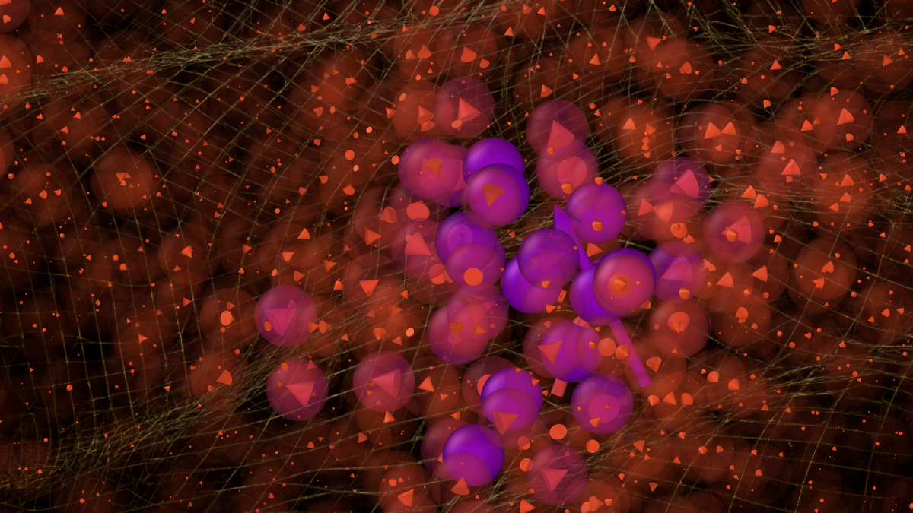

# Finding defects in glasses through machine learning


*by Simone Ciarella, Dmytro Khomenko, Ludovic Berthier, Felix C. Mocanu, David R. Reichman, Camille Scalliet and Francesco Zamponi*
  
Paper links: [**Nat Commun 14, 4229 (2023)**](https://www.nature.com/articles/s41467-023-39948-7)  [*(arXiv)*](https://arxiv.org/abs/2212.05582)

Structural defects control the kinetic, thermodynamic and mechanical properties of glasses. For instance, rare quantum tunneling two-level systems (TLS) govern the physics of glasses at very low temperatures. Because of their extremely low density, it is very hard to directly identify them in computer simulations. We introduce a machine learning approach to efficiently explore the potential energy landscape of glass models and identify desired classes of defects. We focus in particular on TLS and we design an algorithm that is able to rapidly predict the quantum splitting between any two amorphous configurations produced by classical simulations. This in turn allows us to shift the computational effort towards the collection and identification of a larger number of TLS, rather than the useless characterization of non-tunneling defects which are much more abundant. Finally, we interpret our machine learning model to understand how TLS are identified and characterized, thus giving direct physical insight into their microscopic nature. 

---
*In this repository, we share the code used to produce the main findings of the paper. We also show step by step how this approach can be generalized to study other state-to-state transitions.*

---
  

## State-to-state transitions with machine learning

[**Installation**](#Installation)
| [**Quick run**](#Quick-run)
| [**Reproduce TLS results**](#Reproduce-TLS-results)


The idea of this project is to use machine learning to **speed up** the exploration of glassy landscape, that can be found in glassy materials or many other problems characterized by slow dynamics. This repository puts particular emphasis on the concept of *iterative training* that we introduced in the reference paper.
State-to-state transitions like two-level systems are extremely interesting, but when the dynamics is slow they are very hard to find, and the situation is even worse for glassy systems, characterized by an exponential number of states.
The problem is that often the trajectory of the system does not explore directly the targeted state-to-state transitions during the limited observation time.
The ML model that we propose constructs all the pairs of states (even the one that the trajectory never crossed) and rapidly ( s) predicts target crucial properties for the specific transition, thus estimating if the pair is one of the desired transitions and if precise calculation is needed. Overall this significantly reduces the computational load. 


## Installation

To install all the prerequired packages from a fresh conda environment run the following
```
conda create -n tls_exploration -y python=3.9
conda activate tls_exploration
conda install -y -c conda-forge statsmodels
conda install -c conda-forge multiprocess -y
git clone https://github.com/SCiarella/autogluon
cd autogluon && ./full_install.sh
```

> **_NOTE_**:  If you are a MacOS user you need to manually install the correct version of LibOMP via:
```
# brew install wget
wget https://raw.githubusercontent.com/Homebrew/homebrew-core/fb8323f2b170bd4ae97e1bac9bf3e2983af3fdb0/Formula/libomp.rb
brew uninstall libomp
brew install libomp.rb
rm libomp.rb
```

If you are interested in performing [SHAP](https://github.com/slundberg/shap) analysis of the trained model using the scripts provided here, you also need to install the following packages:
```
pip install shap seaborn
```

Then you can proceed with the download of this repository
```
cd ~
git clone https://github.com/SCiarella/TLS_ML_exploration.git
```

The package is already ready to run and it just needs your new data. 

---
## Overview


The repository consists of a series of Python codes named `step[1-4].py`. 

In brief, each of them has the following task:
* *(not included)* **step0**:  data collection and preprocessing

* **step1.py**:  [re-]train the double well (DW) classifier
* **step2.py**:  DW classification
* **step3.py**:  [re-]train the predictor
* **step4.py**:  prediction of the target property of all the pairs (i.e. the quantum splitting)


Those codes run using the content of the MLmodel directory.
There is also a supporting file named `myparams.py` that allows the user to control the procedure as explained in detail in the next section.
Let's discuss step by step this procedure, using as example the TLS identification problem.


#### Step 0: Data collection and preprocessing

The first step of the procedure consists in collecting the relevant input features for the different pairs of states.
In this example, we use one of the collections of IS pairs that we discussed in our [paper](https://arxiv.org/abs/2212.05582), which is stored on Zenodo at [TLS_input_data_Ciarella_et_al_2023](https://zenodo.org/record/8026630).
The database contains pairs of configurations already preprocessed in order to have the following structure:
 
|              |feature 1| feature 2| ... | feature $N_f$ |
|--------------|---------|----------|-----|---------------|
|pair $i_1 j_1$|         |          |     |               |
|pair $i_2 j_1$|         |          |     |               |
|...           |         |          |     |               |
|pair $i_N j_N$|         |          |     |               |

Notice that the database does not contain the output feature (i.e. the quantum splitting in the example), because we do not know its value for all the pairs and the goal of this procedure is to calculate it only for a small selected group of pairs.

In a more general situation, the user will have to implement a `step0` procedure, to preprocess the raw data (i.e. XYZ configurations), into a database containing the relevant information for each pair.
In the paper, we discuss how we ended up with our final set of features and the exclusion process that we used to save memory and space. 
In general, any number of features can be evaluated in `step0` and their importance depends on the specific details of the problem. We discuss [here](https://arxiv.org/abs/2212.05582) which features to use for questions related to TLS and excitations. 
The user will have to identify the set of features that are better suited to capture the specific phenomenon of interest.
On top of the features we discussed in the paper, useful addition could be [SOAP descriptors](https://singroup.github.io/dscribe/1.0.x/tutorials/descriptors/soap.html) or [bond-orientational order parameters](https://pyscal.org/en/latest/examples/03_steinhardt_parameters.html).


#### Step 1: Training the classifier

Next, we train the classifier. The role of the classifier is to exclude pairs that are evidently not in the target group. In our example of TLS search, we know that a non-DW pair can not form a TLS, so we separate them a priori. 
In addition to the input file containing all the features, step 1 makes use of a pretraining set of size $K_0^c$ for the iterative training specified as `myparams.pretraining_classifier`, which has to be placed in the `MLmodel/` directory.
The pretraining file contains the following information:

|              |feature 1|  ... | feature $N_f$ | is in class to exclude ? |
|--------------|---------|------|---------------|:------------------------:|
|pair $i_1 j_1$|         |      |               |           {0,1}          |
|pair $i_2 j_1$|         |      |               |           {0,1}          |
|...           |         |      |               |           ...            |
|pair $i_N j_N$|         |      |               |           {0,1}          |

where the additional binary variable is set to $1$ if the pair is a good candidate for the target search (i.e. a DW), and $0$ if not.
This will be the base for the initial training. Notice that it is also possible to train the model a single time and already achieve good performance if $K_0^c$ is large enough (around $10^4$ pairs for the DW) and the sample is representative.

Furthermore, if the process is at any $i>0$ reiteration of the iterative training scheme, then the program needs to include in its training set the new pairs that have been calculated during the iterative procedure. This can be done by specifying in `myparams.calculations_classifier` the name of the file that lists the results from the exact calculations over the pairs that have been suggested during the previous step of iterative training. This file has to be located in the directory `exact_calculations/In_file_label/`, where the subdirectory In_file_label corresponds to `myparams.In_file` without its extension `.*`. 


#### Step 2: Classifier

The following step is to apply the classifier to the full collection of pairs in order to identify the good subgroup that can contain interesting pairs. 
To do so, the user has simply to run `step2.py`. This will produce as output `output_ML/{In_file_label}/classified_{In_file_label}.csv` which is the database containing the information of all the pairs classified in class-1. Steps 3-4 will perform their operations only on this subset of pairs.


#### Step 3: Training the predictor

We can now train the predictor to estimate the target feature. This corresponds to the quantum splitting or the energy barrier in the context of our TLS search. 
In addition to the file generated by `step2.py` that contains all the pairs estimated to be in the interesting class, step 3 makes use of a pretraining set of size $K_0$ for the iterative training specified as `myparams.pretraining_predictor`, that has to be placed in the `MLmodel/` directory.
The pretraining file contains the following information:

|              |feature 1|  ... | feature $N_f$ | target_feature |
|--------------|---------|------|---------------|:--------------:|
|pair $i_1 j_1$|         |      |               |                |
|pair $i_2 j_1$|         |      |               |                |
|...           |         |      |               |                |
|pair $i_N j_N$|         |      |               |                |

This will be the base for the initial training. Notice that it is also possible to train the model a single time and already achieve good performance if $K_0$ is large enough (around $10^4$ pairs for the TLS) and the sample is representative.

Furthermore, if the process is at any $i>0$ reiteration of the iterative training scheme, then the program needs to include in its training set the new pairs that have been calculated during the iterative procedure. This can be done by specifying in `myparams.calculations_predictor` the name of the file that lists the results from the exact calculations over the pairs that have been suggested during the previous step of iterative training. This file has to be located in the directory `exact_calculations/In_file_label/`, where the subdirectory In_file_label corresponds to `myparams.In_file` without its extension `.*`. 


#### Step 4: Predicting the target feature

The final step of the iteration is to predict the target feature. Running `step4.py` will perform this prediction, and produce as output two files:
```
output_ML/{In_file_label}/predicted_{In_file_label}_allpairs.csv 	
```
containing the prediction of `target_feature` for all the pairs available in `myparams.In_file`, and
```
output_ML/{In_file_label}/predicted_{In_file_label}_newpairs.csv 	
```
that reports the predicted `target_feature` only for the pairs for which the exact calculation is not done. This is useful because the iterative training procedure has to pick the next $K_i$ candidates from this restricted list, in order to avoid repetitions.


#### myparams.py

The supporting file `myparams.py` allows the user to set the correct hyperparameters. Here is reported the list with all the parameters that can be set in this way:
* **In_file**: name of the input file
* **pretraining_classifier**: name of the pretraining file for the classifier
* **pretraining_predictor**: name of the pretraining file for the predictor
* **calculations_classifier**: name of the file containing the list of pairs calculated in class-0
* **calculations_predictor**: name of the file containing the calculation of the target feature
* **class_train_hours**: training time in hours for the classifier
* **pred_train_hours**: training time in hours for the predictor
* **Fast_class**: if True use a lighter ML model for classification, with worse performance but better inference time 
* **Fast_pred**: if True use a lighter ML model for prediction, with worse performance but better inference time
* **ij_decimals**: number of significant digits to identify the states. If they are labeled using an integer number you can set this to 0
* **validation_split**: ratio of data that go into the validation set


#### Test the model

Finally, we also provide two test codes to evaluate the results of the model:
* `test1.py` will compare the predicted target feature with its exact value, over the validation set that was not used to train the model
* `test2.py` will perform the [SHAP](https://github.com/slundberg/shap) analysis for the trained model

The output of both tests will be stored in `output_ML/{In_file_label}/`.
  

---
## Quick run

The first step is to correctly set the parameters in `myparams.py` in order to point to the correct location for the input files.  
The most fundamental and necessary file is the database containing all the available pairs `In_data/{myparams.In_file}`. 
Then in order to start the iterative procedure some initial observations are required. These can either be pretraining sets in `MLmodel/{myparams.pretraining_classifier}` and `MLmodel/{myparams.pretraining_predictor}` or alternatively some calculations over `In_data/{myparams.In_file}` that have to be stored in `exact_calculations/{In_file_label}/{myparams.calculations_classifier}` and `exact_calculations/{In_file_label}/{myparams.calculations_classifier}`.

After this, it is possible to run a full iteration consisting of `step[1-4].py`.
Finally this will produce the output file `output_ML/predicted_{In_file_label}_newpairs.csv` that contains the predicted `target_feature` for all the available pairs:

| conf | i | j | target_feature |
|:----:|:-:|:-:|:--------------:|
| ...  |...|...|...             |
|      |   |   |                |

the database contains only the pairs for which the exact calculation is not available and it is sorted based on the value of `target_feature`.

The final step of the iteration consists in calculating the exact value of `target_feature` for the best $K_i$ pairs, which corresponds to the first $K_i$ lines of `output_ML/predicted_{In_file_label}_newpairs.csv` if the target is a low value of `target_feature`.
You can reiterate this procedure as many times as you want and add new input pairs at any iteration.  
In the [paper](https://arxiv.org/abs/2212.05582), we discuss some criteria to decide the value of $K_0$, the number of iterations and the stopping criterion.


---
## Reproduce TLS results

In order to reproduce the TLS result, we have provided the following [**Zenodo** directory](https://zenodo.org/record/8026630). 
This directory contains the databases `QS_T{0062,007,0092}.feather` corresponding to the pairs that we used for the TLS analysis with all their relevant features, at the three temperatures.
In combination with the `exact_calculations/*/*.csv` containing the results of the NEB calculations (provided in this repository), the TLS data can be processed using the pipeline discussed above to reproduce all the findings reported in the [paper](https://arxiv.org/abs/2212.05582).

Finally, in the directory `TLS_pairs_Khomenko_et_al_2020` we report the data corresponding to the smaller set of TLS pairs identified in *Khomenko et al. PRL 124.22 (2020): 225901*.